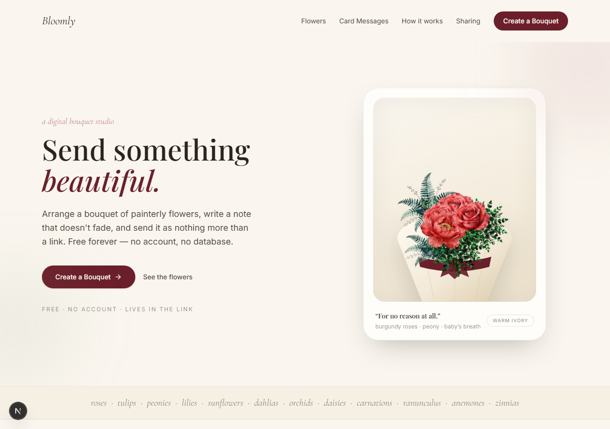
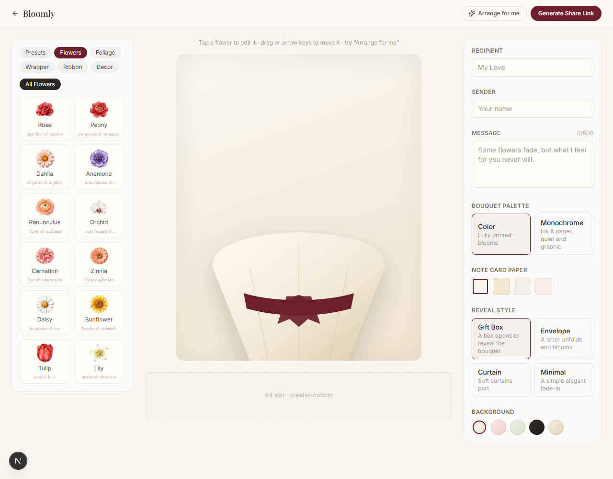
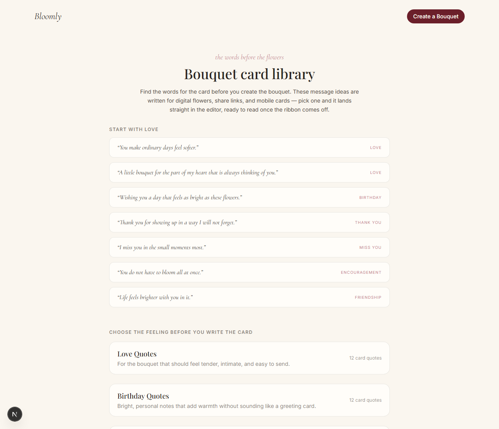
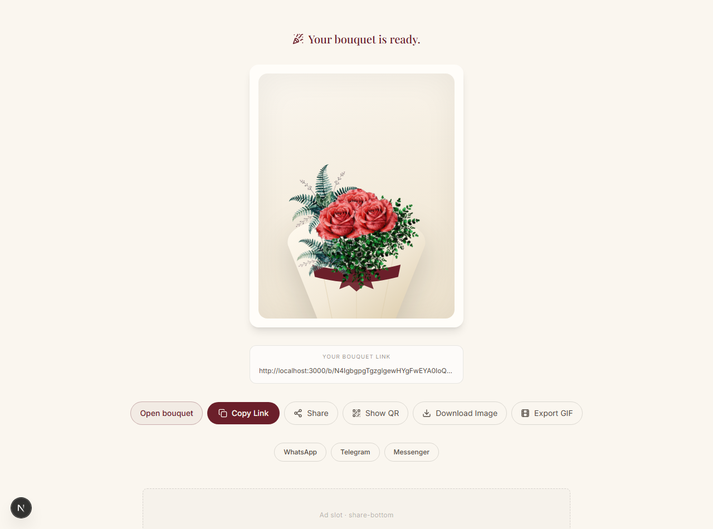
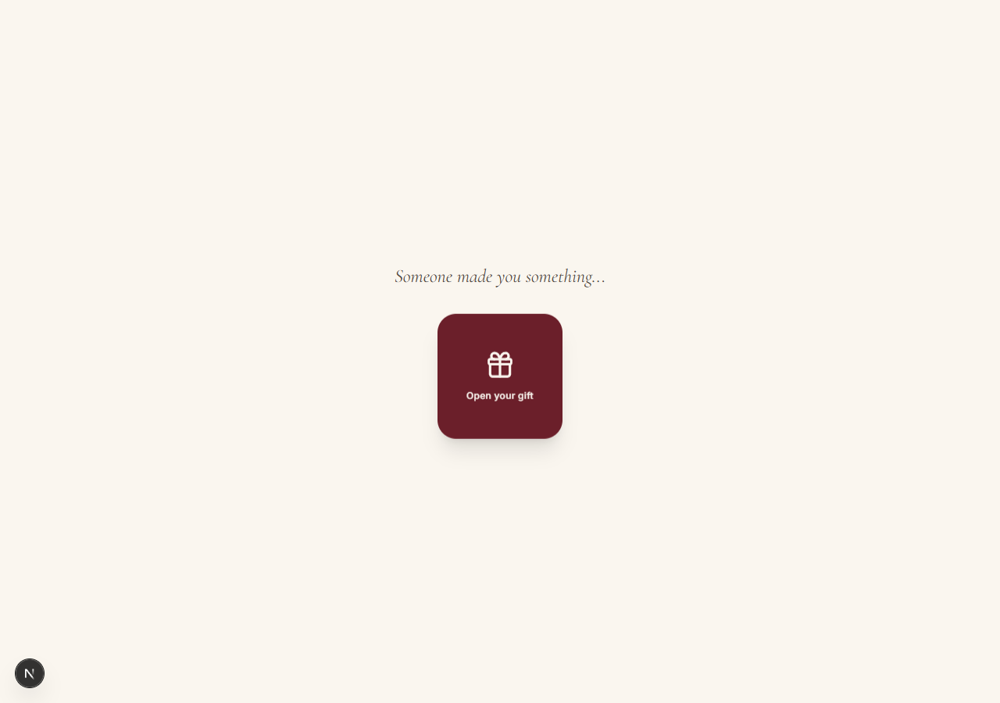
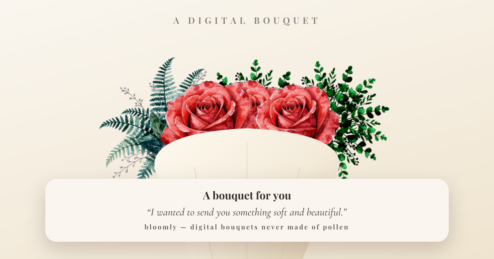

# Bloomly

**Create a beautiful digital bouquet, write a personal message, and send it to
someone special.** Free, no account, no database — the link **is** the bouquet.

- **No sign-up, no server storage** — every flower, wrapper, ribbon and word is
  compressed into the URL itself, so a bouquet lives exactly as long as it
  circulates.
- **Realistic flowers** — a dozen painterly, photo-real bloom illustrations
  (with their language-of-flowers meanings) plus greenery, arranged in a
  wrapped paper cone.
- **It arrives as a gift** — the recipient follows the link and a soft,
  theatrical reveal plays out before their eyes, ending on the bouquet and a
  handwritten-style note.
- **Looks premium everywhere it's pasted** — WhatsApp, iMessage and Telegram
  show a real 1200×630 social card drawn from the *same* art, generated
  server-side.

Inspired by the warm, editorial feel of [digibouquet.org](https://digibouquet.org/).

<br />

## Screenshots

> Captured at 1280×900 — every visual below is the real running app.

| The landing page: hero, flower library, presets | The bouquet editor: arrange stems live |
| --- | --- |
|  |  |

| The card-message library (`/quotes`) | The share page after sending (`/s/…`) |
| --- | --- |
|  |  |

| The recipient's reveal (`/b/…`) | The generated social card (`/opengraph-image`) |
| --- | --- |
|  |  |

<br />

## Features

### 🌸 Realistic, digibouquet-style flower art
Twelve painterly blooms as transparent cutouts — **rose, peony, dahlia, anemone,
ranunculus, orchid, carnation, zinnia, daisy, sunflower, tulip, lily** — plus
three greenery bases (**eucalyptus, fern, baby's breath**). The same art renders
in the editor, the reveal, the landing page and the social card.

### 💐 The language of flowers
Every bloom carries its meaning (rose = *deep love & passion*, tulip = *perfect
love*, peony = *prosperity & romance*, …), shown in the editor under each flower
and on the landing page — so an arrangement *says* something.

### 🎚 Color or monochrome
A palette toggle switches the whole bouquet between fully-printed color and a
graphic ink-and-paper grayscale. It applies live in the editor, in the reveal,
and even in the exported PNG/GIF and the social card.

### 📜 Note card paper
The message arrives on a paper you choose — **paper, parchment, ivory, blush** —
with matching ink tones, exactly like a handwritten card kept inside the gift.

### 🗞 Card-message library (`/quotes`)
Six categories of ready-to-send notes (love, birthday, thanks, miss you,
encouragement, friendship). Each quote drops straight into the editor via
`/create?quote=…`, pre-filled on the note card.

### 🎁 A theatrical reveal
Four reveal styles — **Gift Box, Envelope, Curtain, Minimal** — open the bouquet
with a choreographed entrance on the recipient's device.

### 🖐 An editor, not a picker
Drag every stem into place, rotate and scale it, move it with the arrow keys,
layer it by z-depth, or hit **"Arrange for me"**. Start from six curated
presets or an occasion. Finish with wrappers (8), ribbons (8), backgrounds (5)
and decorations (pearl pins, wax seals, twine, berry sprigs).

### 📤 Everything a bouquet needs to travel
Copy link · QR code · **keepsake PNG** · **animated looping GIF** · native share
· socials. A per-bouquet `og:image` preview is generated for every link.

### 🔁 It comes back
The receiver can reply with a bouquet of their own — because the link already
carries every detail, "send one back" is free.

<br />

## How it works

1. **Create** — pick a wrapper, ribbon and background, then compose a bouquet
   from a dozen painterly blooms plus greenery and decorations. Drag each stem
   into place, rotate and scale it over a live canvas, and finish with a
   recipient, sender and message. Style it further with a **color or
   monochrome** palette and choose the **note card paper** (paper, parchment,
   ivory, blush).
2. **Share** — the whole layout is serialized into a compact, URL-safe token
   (`lz-string` + `safe-encode`) and handed over as a plain link, a QR code, a
   **keepsake PNG, or an animated looping GIF**, plus one-tap native share. No
   accounts, no sync, no server round-trips.
3. **Reveal** — `/b/<token>` plays an animated entrance of the bouquet and the
   note. The per-bouquet social preview is generated server-side with
   `next/og` from the shared components, so the thumbnail is never a generic
   screenshot.

<br />

## The flower catalog

| Bloom | Meaning |
| --- | --- |
| **Orchid** | rare beauty & strength |
| **Tulip** | perfect love |
| **Dahlia** | elegance & dignity |
| **Anemone** | anticipation & sincerity |
| **Carnation** | love & admiration |
| **Zinnia** | lasting affection |
| **Ranunculus** | charm & radiance |
| **Sunflower** | loyalty & warmth |
| **Lily** | purity & devotion |
| **Daisy** | innocence & joy |
| **Peony** | prosperity & romance |
| **Rose** | deep love & passion |

Greenery bases: **Eucalyptus**, **Fern**, **Baby's Breath**. Older catalog ids
(from the earlier procedural version of Bloomly) still resolve, so share links
created before the art upgrade keep rendering.

<br />

## Design language — "The Pressed Flower Keepsake"

Bloomly feels like a keepsake pressed between the pages of a book, not a SaaS
dashboard with flower emoji.

> Warm paper tones, a single deep accent color spent sparingly, hairline borders
> instead of drop-shadowed cards. The illustrated bouquet carries all the color
> and detail; the chrome around it steps back so the gift stays the visual hero
> of every screen.

### Palette

A warm, paper-toned neutral field with one restrained accent:

| Role | Color | Hex | Where it lives |
| --- | --- | --- | --- |
| Accent | **Oxblood** | `#6b1f2a` | Primary CTAs, active states, the ribbon motif. The only saturated UI color. |
| Accent hover | **Oxblood Deep** | `#4a1420` | Press/hover of primary actions. |
| Neutral | **Warm Ivory** | `#faf6ef` | Page background. |
| Neutral | **Warm Ivory Deep** | `#f2ead9` | Alternating sections, subtle fills. |
| Neutral | **Paper** | `#fffdf9` | Card and panel surfaces. |
| Text | **Charcoal / Soft** | `#2a2521` / `#524a43` | Headlines / secondary copy. |
| Botanical only | **Sage Leaf** | `#8a9a7e` | Foliage accents, never UI chrome. |

**The One Accent Rule** — oxblood appears only on primary actions and active
states. **The Hairline-Not-Card Rule** — containers are edged with `charcoal`
at 8–25% opacity, not heavy borders or fills. The bouquet illustration is the
only place saturated color is allowed to live freely.

### Typography

- **Playfair Display** (with Georgia fallback) — display type, headlines,
  names, "A DIGITAL BOUQUET".
- **Cormorant Garamond**, italic — the personal, handwritten-feel accent at the
  heart of the message.
- **Inter** — labels, UI chrome, body copy. Serif carries emotion; sans-serif
  carries function.

<br />

## The bouquet art, three render paths

The art is a set of **raster cutouts** (transparent webp) plus a small set of
vector decorations. The same `BouquetAsset` component renders them in three
places, each with its own constraints:

1. **Editor & reveal (DOM)** — real `` tags with the static `/flora/*.webp`
   path. Monochrome mode is a CSS `grayscale(1)` filter, which `html-to-image`
   also captures for PNG/GIF exports. Vector decorations render as SVG.
2. **The 1200×630 social card (satori)** — satori can't fetch network images,
   so `lib/og/floraImage.ts` downscales each used cutout with **sharp** into a
   base64 **PNG data URI** (grayscaled server-side for mono bouquets) and that
   `imageMap` is threaded into the card. Sharp is externalized
   (`serverExternalPackages`) so it runs natively at build/request time.
3. **The landing page** — the hero bouquet and the flower library use the same
   `BouquetAsset`, so marketing and product stay pixel-identical.

Procedural SVG is kept only for decorations (pearl pins, wax seals, twine, berry
springs) and as a fallback for unknown ids. Old decorative elements render from
plain render functions emitting raw `<path>`/`<circle>`/`<g>` host elements so
satori doesn't drop them.

### How a link becomes a bouquet

- **Encode** — `lib/bouquet/encoder.ts` serializes the bouquet object, compresses
  it with `lz-string`, and applies a URL-safe alphabet.
- **Decode + validate** — `lib/bouquet/validator.ts` never trusts URL input:
  freeform text is stripped of control/HTML characters, sizes are clamped,
  unknown ids are dropped, counts are capped. An element's category is derived
  from its *canonical* asset definition rather than the value stored in the
  URL, so old links survive catalog re-organizations (e.g. a baby's breath that
  was once a "flower" cleanly migrates to "foliage").
- **Layout** — `lib/bouquet/composer.ts`'s `autoArrange` generates balanced
  arrangements from a flat id list; `BouquetCanvas` positions each element from
  its own stem with a computed size and z-depth.
- **Card fit** — `lib/og/BouquetCard.tsx`'s `fitLayout` re-lays the bouquet out
  between the eyebrow and the message plate at any scale.

<br />

## Routes

| Route | Purpose |
| --- | --- |
| `/` | Landing — hero bouquet, flower library, presets, occasions, card-message teaser |
| `/create` | Bouquet editor — drag / rotate / scale canvas, palette, note card paper |
| `/quotes` | Card-message library — 6 categories, each drops into `/create` via `?quote=` |
| `/s/<token>` | Post-create share page — copy link, QR, PNG, **GIF**, native share, socials |
| `/b/<token>` | Recipient's reveal page |
| `/b/<token>/opengraph-image` | Per-bouquet social card |
| `/opengraph-image` | Site-level social card (sample bouquet) |
| `/privacy`, `/terms` | Legal pages |

<br />

## Tech

| Tool | Role |
| --- | --- |
| **Next.js 16** (App Router, Turbopack) | App framework, file-based OG routes |
| **TypeScript · Tailwind CSS** | Typed app + the design-system utilities |
| **Framer Motion** | Reveal choreography, canvas entrance animations |
| **`lz-string`** | Token compression (`%2B`-corruption recovery server-side) |
| **`next/og` (satori)** | Real-time 1200×630 social previews |
| **`sharp`** | Raster flowers → PNG data URIs (mono-aware) for satori |
| **`html-to-image`** | PNG export of the bouquet card |
| **`gifenc`** | Animated GIF export (shared palette, 30-frame loop) |
| **`qrcode`** | Share QR codes |

<br />

## Developing

```bash
npm install
npm run dev
```

Open http://localhost:3000.

> Windows note: run the dev server as `npm.cmd run dev` if plain `npm` fails
> to resolve.

## Checking

```bash
npm run lint
npx tsc --noEmit
npm run build
```

## Deploy

Any Node host works — the app is fully static-capable. Set
`NEXT_PUBLIC_SITE_URL` to your production origin so open graph URLs resolve
correctly; Vercel sets this automatically via `VERCEL_URL`.